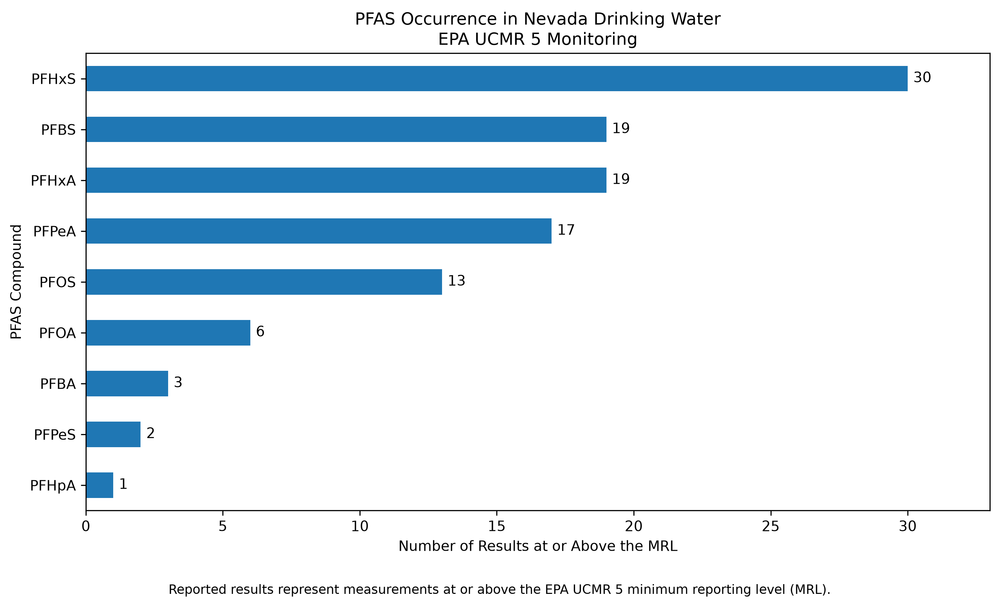
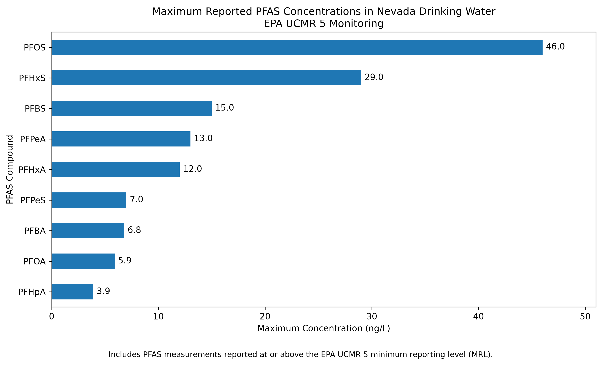
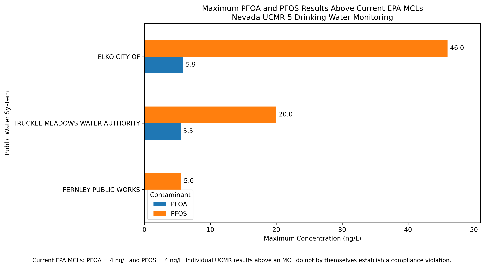

# Nevada PFAS Drinking Water Analysis

## Project Overview

This project examines PFAS occurrence in Nevada public drinking water systems using data from the U.S. Environmental Protection Agency's Fifth Unregulated Contaminant Monitoring Rule (UCMR 5).

The project began as an investigation of PFAS monitoring data in Clark County using the Water Quality Portal (WQP). Initial data exploration showed limited PFAS results for the county, which led me to expand the analysis using EPA UCMR 5 occurrence data. The UCMR 5 dataset provided broader statewide drinking water monitoring data and allowed for a more complete analysis of PFAS occurrence across Nevada.

Using Python, I extracted and cleaned Nevada records from the larger UCMR 5 dataset, standardized PFAS concentrations to ng/L, profiled the data, and evaluated reported results. The cleaned dataset was then loaded into PostgreSQL, where SQL was used to independently validate the findings and analyze PFAS occurrence by compound, sampling location, and public water system.

## Key Findings

- The cleaned Nevada dataset contains **17,574 PFAS records** representing **58 public water systems** and **147 sampling locations**.
- **29 PFAS compounds** were included in the Nevada UCMR 5 monitoring data.
- Most results (**17,464 of 17,574**) were reported below the applicable UCMR 5 minimum reporting level (MRL).
- **110 results** were reported at or above the MRL across **10 public water systems** and **28 sampling locations**.
- PFHxS was the most frequently reported PFAS at or above the MRL, with **30 results**.
- PFOS had the highest maximum reported concentration at **46 ng/L**.
- PFOA and PFOS results above their current **4 ng/L EPA MCL benchmarks** occurred in several Nevada systems, including Elko City, Truckee Meadows Water Authority, and Fernley Public Works.
- An individual UCMR 5 measurement above an MCL does not by itself establish a regulatory compliance violation.

## Tools and Skills

- **Python:** pandas, matplotlib
- **SQL:** PostgreSQL
- **Data profiling and cleaning**
- **Large dataset filtering and transformation**
- **Environmental data analysis**
- **Regulatory benchmark comparison**
- **Data visualization**
- **Git and GitHub**

## Data Sources

### EPA UCMR 5

The primary dataset for the statewide analysis is EPA's Fifth Unregulated Contaminant Monitoring Rule (UCMR 5) occurrence data. UCMR 5 includes drinking water monitoring results for PFAS and lithium collected from public water systems.

For this project, the multistate occurrence dataset was filtered to Nevada records and then to the 29 PFAS compounds included in the monitoring data. Lithium was excluded because the analysis focuses specifically on PFAS.

### Water Quality Portal

The project initially used PFAS data obtained through the Water Quality Portal (WQP) from USGS and STORET/EPA sources. Exploration of those records showed limited PFAS monitoring data for Clark County, so WQP was retained as part of the exploratory workflow while UCMR 5 became the primary dataset for the statewide analysis.

## Methodology

1. Downloaded EPA UCMR 5 occurrence data and reviewed the dataset structure and documentation.
2. Used Python and pandas to process the large multistate file and extract Nevada records.
3. Removed lithium to create a PFAS-specific dataset.
4. Profiled the data for public water systems, sampling locations, compounds, dates, reporting thresholds, and analytical results.
5. Converted reported concentrations from µg/L to ng/L for easier interpretation and comparison.
6. Identified results reported at or above UCMR 5 minimum reporting levels (MRLs).
7. Loaded the cleaned **17,574-record** Nevada PFAS dataset into PostgreSQL.
8. Used SQL to independently reproduce occurrence counts, concentration summaries, system-level results, and regulatory benchmark comparisons.
9. Created Python visualizations to communicate the major findings.

## Results and Visualizations

### PFAS Occurrence

PFHxS was the most frequently reported PFAS at or above the UCMR 5 minimum reporting level, with 30 results. PFBS and PFHxA followed with 19 results each.



### Maximum Reported Concentrations

The frequency of reported PFAS did not necessarily correspond with the highest concentrations. Although PFHxS was reported most frequently, PFOS had the highest maximum reported concentration at **46 ng/L**, followed by PFHxS at **29 ng/L**.




### PFOA and PFOS by Public Water System

PFOA and PFOS results above the current EPA MCL benchmark of **4 ng/L** were concentrated in a small number of Nevada public water systems. Elko City had the highest PFOS result at **46 ng/L**, while Truckee Meadows Water Authority reached **20 ng/L**. Fernley Public Works had a maximum PFOS result of **5.6 ng/L**.



These results describe individual UCMR 5 monitoring measurements and should not be interpreted as regulatory compliance determinations. Drinking water compliance is evaluated using EPA-defined monitoring and compliance procedures rather than a single analytical result.

## Regulatory Context

EPA established drinking water standards for several PFAS under the National Primary Drinking Water Regulation. This analysis uses the current individual MCL values of **4 ng/L for PFOA** and **4 ng/L for PFOS** as comparison benchmarks.

PFAS drinking water regulations continue to evolve. For that reason, benchmark comparisons in this project represent the regulatory framework used at the time of analysis and should be interpreted with the date and regulatory context in mind.

## Limitations

- UCMR 5 is a monitoring dataset and does not represent every drinking water source or every possible PFAS exposure pathway in Nevada.
- Results below the UCMR 5 minimum reporting level were not treated as quantified concentrations.
- The number of monitoring results varies among public water systems and sampling locations, so occurrence counts should not be interpreted as direct measures of system-wide contamination.
- Individual measurements above an EPA MCL do not by themselves establish a regulatory compliance violation.
- This analysis focuses on PFAS occurrence in drinking water and does not evaluate health outcomes or individual exposure.
- Regulatory requirements and PFAS standards may change over time.

## Project Structure

```text
PFAS_Clark_County/
├── README.md
└── figures/
    ├── 01_pfas_occurrence_nevada.png
    ├── 02_pfas_max_concentration_nevada.png
    └── 03_pfoa_pfos_system_comparison.png

02_Python/Projects/PFAS_Clark_County/
├── 05_ucmr5_nevada_profiling.py
└── 06_ucmr5_visualizations.py

01_SQL/Projects/PFAS_Clark_County/
└── 02_nevada_ucmr5_analysis.sql

09_Data/PFAS_Clark_County/
├── raw/
└── processed/
```

## Project Takeaway

This project demonstrates an end-to-end environmental data workflow, from evaluating data sources and processing a large federal dataset to database analysis and visualization. A key part of the process was recognizing that the initial Clark County dataset was too limited for the intended analysis and identifying a more appropriate EPA dataset rather than drawing conclusions from insufficient data.
